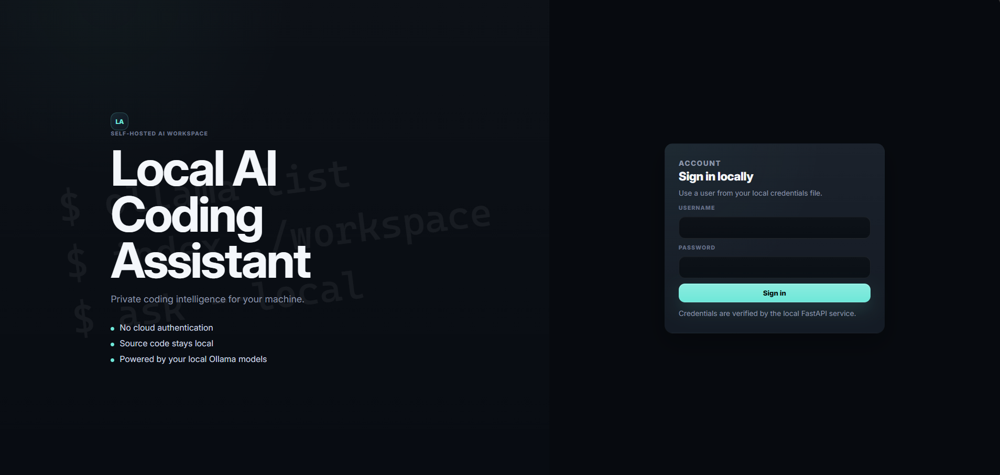
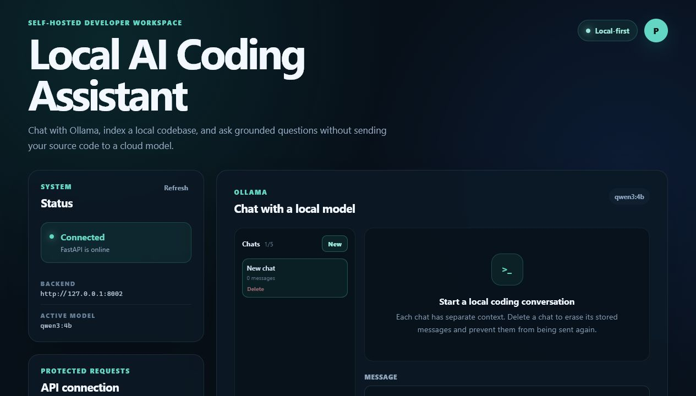
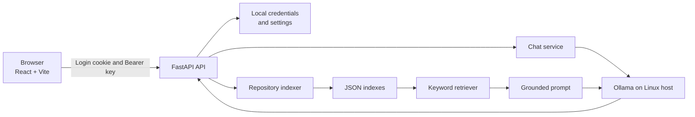

<div align="center">

# Local AI Coding Assistant

**A private, self-hosted workspace for chatting with local language models and
asking source-grounded questions about your own codebases.**

[](https://www.python.org/)
[](https://fastapi.tiangolo.com/)
[](https://react.dev/)
[](https://ollama.com/)
[](https://docs.docker.com/compose/)
[](#testing)
[](LICENSE)

</div>

> [!IMPORTANT]
> **Continuous development:** This project is actively evolving. The current
> release is a functional portfolio-grade MVP, but interfaces, retrieval
> quality, deployment options, and tests will continue to improve.

## Overview

Local AI Coding Assistant is a full-stack application designed for developers
who want useful AI-assisted code exploration without sending source code to a
cloud model provider.

The application connects a React dashboard to a FastAPI backend and a locally
installed Ollama model. Users can authenticate, manage an API key, switch
between locally pulled models, and maintain isolated conversations. Repository
indexing and grounded code Q&A remain available through the API while the
dashboard workspace is being redesigned.

Internet access is required only when installing dependencies or downloading
new Ollama models. Chat prompts, generated repository indexes, credentials,
API keys, and source code remain on the host machine during normal use.

## Application Preview

### Local Login



### Developer Dashboard



## Why This Project

This project demonstrates more than a basic LLM chat interface:

- **Full-stack engineering:** React/Vite frontend, FastAPI backend, typed
  request schemas, documented APIs, and containerized deployment.
- **Local AI integration:** Direct Ollama model management and inference with
  no cloud LLM dependency.
- **Retrieval-augmented generation:** Repository discovery, line-aware
  chunking, ranked retrieval, grounded prompts, and source attribution.
- **Security-conscious configuration:** Salted password hashes, HttpOnly
  sessions, Bearer authentication, ignored secret files, and safe templates.
- **Operational readiness:** Health checks, Docker Compose, non-root backend
  execution, restart policies, setup scripts, and automated tests.

## Features

### Private Local AI

- Runs inference through Ollama on the host machine.
- Lists every model installed in the local Ollama library.
- Switches between installed models by updating the active-model setting
  without deleting model files.
- Displays model installation progress, connection state, and user-facing
  errors.
- Bounds chat context and model output to keep local inference responsive.

### Authentication and Account Management

- Login page backed by an editable local credentials file.
- Passwords stored as salted PBKDF2 hashes, never as plaintext.
- HttpOnly login sessions for account and model-management operations.
- Bearer API-key protection for chat and repository endpoints.
- Locally persisted API-key configuration with connection verification.
- No usernames, passwords, or API keys hardcoded in the source tree.

### Conversations

- Up to five browser-local chats per username.
- Isolated history and context for each conversation.
- Conversation context survives model changes and is supplied to whichever
  model the user selects next.
- Complete chat deletion so removed messages are excluded from future prompts.
- A maximum of 30 recent messages per request, further bounded by a backend
  context-size limit.

### Repository Intelligence

- Repository indexing is currently API-only while the dashboard workspace is
  being redesigned for a future plus-button upload flow.
- Recursive indexing of local code repositories.
- Support for Python, JavaScript, TypeScript, React, Markdown, JSON, YAML,
  HTML, and CSS.
- Automatic exclusion of generated or dependency-heavy directories such as
  `.git`, `node_modules`, `.venv`, `dist`, and `build`.
- Human-readable JSON indexes with file paths and source line ranges.
- Keyword-overlap retrieval for transparent, dependency-light RAG.
- Grounded answers that return the source file paths used as context.

### Deployment and Developer Experience

- Dockerfiles for the FastAPI backend and production Nginx frontend.
- Docker Compose health checks and detached deployment.
- Linux setup and startup scripts.
- OpenAPI documentation at `/docs`.
- Dependency-injected pytest coverage that does not require Ollama or Docker.
- LAN access for trusted devices on the same home network.

## Architecture



### Request Flow

1. The user signs in with credentials stored in an ignored local JSON file.
2. The browser receives an HttpOnly session cookie for account controls.
3. Protected AI requests include the configured Bearer API key.
4. Chat requests are sent to the active Ollama model.
5. Repository questions retrieve relevant chunks from a local JSON index.
6. Retrieved code is inserted into a grounded prompt and sent to Ollama.
7. The API returns the generated answer and contributing source paths.

Detailed design notes are available in
[docs/architecture.md](docs/architecture.md).

## Technology Stack

| Area | Technology | Responsibility |
| --- | --- | --- |
| Frontend | React 18, Vite 8, CSS | Authentication, chat, status, account, and model UI |
| Backend | Python, FastAPI, Pydantic | APIs, validation, sessions, orchestration |
| Local inference | Ollama | Model downloads, lifecycle, and text generation |
| Retrieval | Python JSON index and keyword ranking | Code chunking, retrieval, and grounding |
| HTTP client | HTTPX | Async communication with Ollama |
| Deployment | Docker, Docker Compose, Nginx | Reproducible frontend and backend services |
| Testing | pytest, FastAPI TestClient, node:test | API, authentication, frontend API, model, and chat regression tests |

## Local Model Discovery

The model dropdown is built from `GET /api/tags` on the local Ollama service.
Every installed model Ollama reports appears automatically. No parameter-size
filter or model-name allowlist is maintained in the application, so you decide
which models are appropriate for your hardware by choosing what to pull with
Ollama.

Pull any suitable models directly with Ollama:

```bash
ollama pull qwen3:4b
ollama pull qwen2.5-coder:3b
ollama pull llama3.2:3b
ollama list
```

While Account is open, the inventory refreshes every five seconds; the
**Refresh local models** button updates it immediately. Model selection
requires no internet connection, and the application never automatically
downloads or deletes model files. To reclaim disk space manually, use
`ollama rm MODEL_NAME`.

## Quick Start

### Prerequisites

The primary target is a Linux Mint machine with:

- Python 3.10 or newer
- Node.js 20.19+ or 22.12+
- npm
- Ollama
- Docker Engine and Docker Compose for container deployment
- An NVIDIA GPU and working driver are recommended, but not required

Verify optional NVIDIA acceleration:

```bash
nvidia-smi
```

Install Ollama using the
[official Linux instructions](https://docs.ollama.com/linux), then pull the
default model:

```bash
ollama pull qwen3:4b
curl http://127.0.0.1:11434/api/tags
```

### Local Development

From the repository root:

```bash
bash scripts/setup.sh
.venv/bin/python scripts/manage_credentials.py set YOUR_USERNAME
bash scripts/start.sh
```

Open:

- Frontend: `http://localhost:5173`
- Backend: `http://localhost:8000`
- OpenAPI docs: `http://localhost:8000/docs`

After signing in, open the account menu and create an API key. Short keys are
accepted for local testing, but a longer private key is recommended for normal
use. The application stores it only in ignored local configuration and the
current browser profile.

Press `Ctrl+C` in the startup terminal to stop both development servers.

### Docker Compose

Ollama remains installed on the Linux host. Compose runs the frontend and
backend:

```bash
cp .env.example .env
cp backend/.env.example backend/.env
mkdir -p data/config
cp credentials.example.json data/config/credentials.json
cp app-settings.example.json data/config/app-settings.json
python3 scripts/manage_credentials.py set YOUR_USERNAME
sed -i "s/^APP_UID=.*/APP_UID=$(id -u)/" .env

docker compose up --build --detach
docker compose ps
```

Both services should eventually report as healthy. Useful lifecycle commands:

```bash
docker compose logs --follow
docker compose restart
docker compose down
```

Detached containers continue running after the terminal or SSH session closes.
The `restart: unless-stopped` policy restarts them after a reboot once Docker
is available.

## Access from Another Computer

The application can be used from another trusted device on the same network.
Find the Linux host address:

```bash
hostname -I
```

By default, `FRONTEND_API_BASE_URL=auto` makes the browser call the backend on
the same hostname or IP address you used to open the frontend. For a host
address such as `192.168.1.50`, open:

```text
http://192.168.1.50:5173
```

If you previously hardcoded `FRONTEND_API_BASE_URL` in `.env`, either remove
that override or set it back to:

```dotenv
FRONTEND_API_BASE_URL=auto
```

Then rebuild the frontend once:

```bash
docker compose up --build --detach
```

> [!WARNING]
> This is a trusted-network application. Do not expose ports `5173`, `8000`,
> or `11434` directly to the public internet.

## Using the Application

### Chat with a Model

1. Sign in with a configured local user.
2. Open the account menu and save an API key.
3. Verify the API status shows as connected.
4. Select one of the models installed in Ollama.
5. Create a chat and submit a prompt.

Changing models does not clear the selected conversation. Its saved history is
passed to the newly active model until the user deletes that chat.

### Index a Repository

For local development, enter an absolute path readable by the backend:

```text
/home/user/projects/example-repository
```

For Docker, repositories are mounted read-only beneath `/repositories`:

```text
/repositories/sample-code-repository
```

### Ask a Grounded Question

After indexing, provide the generated repository name and ask a focused
question. The response includes the source paths selected by the retriever.

## API Reference

| Method | Endpoint | Authentication | Purpose |
| --- | --- | --- | --- |
| `GET` | `/` | Public | Application metadata |
| `GET` | `/health` | Public | Backend health check |
| `POST` | `/auth/login` | Credentials | Start a local session |
| `GET` | `/auth/me` | Session cookie | Return the signed-in user |
| `POST` | `/auth/logout` | Session cookie | End the session |
| `GET` | `/account/status` | Session cookie | Check account and API-key state |
| `PUT` | `/account/api-key` | Session cookie | Save a local API key |
| `GET` | `/models/status` | Session cookie | Return model and switch status |
| `POST` | `/models/switch` | Session cookie | Select an installed local model |
| `POST` | `/chat` | Bearer key | Generate a chat response |
| `POST` | `/repos/index-local` | Bearer key | Index a local repository |
| `POST` | `/repos/ask` | Bearer key | Ask a grounded repository question |

### Example Chat Request

```bash
export API_KEY="your-local-api-key"

curl -X POST http://localhost:8000/chat \
  -H "Authorization: Bearer $API_KEY" \
  -H "Content-Type: application/json" \
  -d '{"message":"Explain dependency injection in FastAPI."}'
```

### Example Repository Request

The dashboard repository workspace is temporarily hidden, but the backend API
remains available:

```bash
curl -X POST http://localhost:8000/repos/index-local \
  -H "Authorization: Bearer $API_KEY" \
  -H "Content-Type: application/json" \
  -d '{"path":"/repositories/sample-code-repository"}'

curl -X POST http://localhost:8000/repos/ask \
  -H "Authorization: Bearer $API_KEY" \
  -H "Content-Type: application/json" \
  -d '{
    "repo_name":"sample-code-repository",
    "question":"Where are the calculator functions implemented?"
  }'
```

See [docs/api.md](docs/api.md) for request schemas, responses, and errors.

## Repository Indexing

Supported file extensions:

```text
.py .js .jsx .ts .tsx .md .json .yaml .yml .html .css
```

Ignored directories:

```text
.git node_modules .venv __pycache__ dist build
```

Indexes are stored as readable JSON under `data/indexes/`. Re-indexing a
directory with the same final directory name replaces its previous index.

GitHub cloning is not implemented yet. Clone a GitHub repository locally, then
index its local path.

## Configuration

Safe templates are committed for every local configuration file:

| Template | Local file | Purpose |
| --- | --- | --- |
| `.env.example` | `.env` | Docker build, LAN address, and repository mounts |
| `backend/.env.example` | `backend/.env` | Backend, Ollama, and security settings |
| `frontend/.env.example` | `frontend/.env` | Development API URL |
| `credentials.example.json` | `data/config/credentials.json` | Local users and password hashes |
| `app-settings.example.json` | `data/config/app-settings.json` | Active API key and model |

Important inference settings:

| Variable | Default | Purpose |
| --- | ---: | --- |
| `OLLAMA_TIMEOUT_SECONDS` | `120` | Generation request timeout |
| `OLLAMA_NUM_PREDICT` | `768` | Maximum generated tokens |
| `OLLAMA_THINK` | `false` | Enable supported models' extended thinking |
| `OLLAMA_KEEP_ALIVE` | `10m` | Keep the active model loaded between requests |
| `CHAT_CONTEXT_MAX_CHARS` | `12000` | Bound conversation context size |
| `RAG_TOP_K` | `5` | Maximum retrieved chunks added to a RAG prompt |

Real `.env`, credentials, application settings, generated indexes, virtual
environments, dependencies, and build output are excluded by `.gitignore`.

## Testing

The test suite uses isolated temporary configuration and a fake Ollama service,
so it does not require a model download, Docker, or network access:

```bash
source .venv/bin/activate
python -m pip install -r backend/requirements-dev.txt
python -m pytest

cd frontend
npm test
```

Current coverage includes:

- Health and application metadata
- Missing and invalid Bearer authentication
- Login, logout, and invalid local credentials
- API-key persistence and status checks
- Dynamic local model discovery and installed-model reuse
- Mocked chat generation and context-size regression protection
- Ollama generation limits and request options
- Frontend API-host resolution for LAN access
- Login session-cookie verification before entering the dashboard

## Security and Privacy

- Passwords are salted and hashed with PBKDF2.
- Login sessions are stored in backend memory and delivered through HttpOnly
  cookies.
- Protected AI routes use constant-time Bearer-key comparison.
- Secrets and mutable configuration are stored only in ignored local files.
- Repository mounts are read-only in the default Docker configuration.
- Logs include operational metadata, not prompts, passwords, or API keys.
- Model switching rejects names that are not installed in local Ollama.

This project is designed for a trusted local network, not as a hardened
internet-facing multi-tenant service. Review the
[current limitations](#current-limitations) before broader deployment.

## Project Structure

```text
local-ai-coding-assistant/
|-- backend/
|   |-- app/
|   |   |-- auth/          # Credentials, sessions, and Bearer validation
|   |   |-- rag/           # Chunking, indexing, and retrieval
|   |   |-- routers/       # FastAPI route modules
|   |   |-- schemas/       # Pydantic request and response models
|   |   `-- services/      # Ollama, model, settings, and repo services
|   |-- Dockerfile
|   `-- requirements*.txt
|-- frontend/
|   |-- src/components/    # Login, chat, account, status, and repo UI
|   |-- Dockerfile
|   `-- nginx.conf
|-- tests/                 # Isolated backend tests
|-- scripts/               # Linux setup, startup, and credential tools
|-- docs/                  # Architecture, API, and setup guides
|-- data/                  # Ignored local settings and generated indexes
|-- sample-code-repository/
|-- docker-compose.yml
`-- Makefile
```

## Current Limitations

- Retrieval uses keyword overlap instead of semantic embeddings.
- Repository indexes are JSON files and are not optimized for large monorepos.
- Chat responses are returned after full generation rather than streamed.
- Login sessions are in memory and end when the backend restarts.
- Browser chat persistence uses local storage on the current device.
- GitHub repositories must be cloned locally before indexing.
- The default deployment assumes a trusted home or development network.

## Roadmap

- Add local embeddings and a vector database such as Qdrant or Chroma.
- Stream Ollama responses and model-switch events to the frontend.
- Add safe GitHub clone and update workflows.
- Introduce language-aware parsing with Tree-sitter.
- Add repository lifecycle controls and index freshness metadata.
- Expand frontend and repository retrieval test coverage.
- Add linting, test, and Docker-build checks through GitHub Actions.
- Support HTTPS deployment through a reverse proxy.

## Documentation

- [Architecture](docs/architecture.md)
- [API reference](docs/api.md)
- [Linux Mint setup](docs/setup.md)

## Contributing

This project is under continuous development. Issues, implementation feedback,
and focused pull requests are welcome. Please avoid committing secrets,
generated indexes, local model files, or machine-specific configuration.

## License

Distributed under the MIT License. See [LICENSE](LICENSE).
