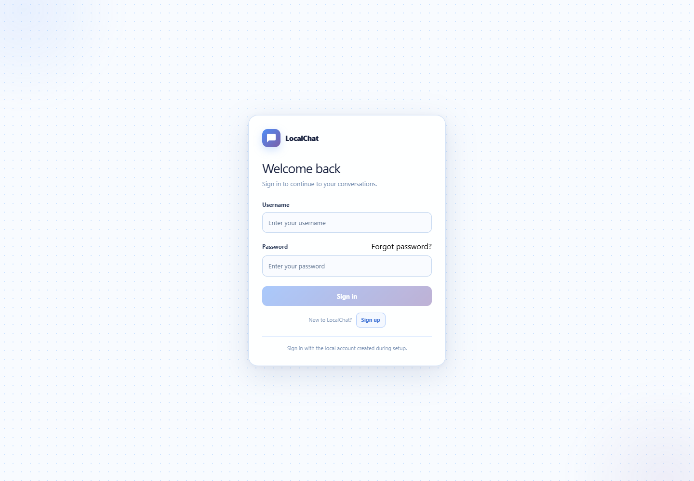
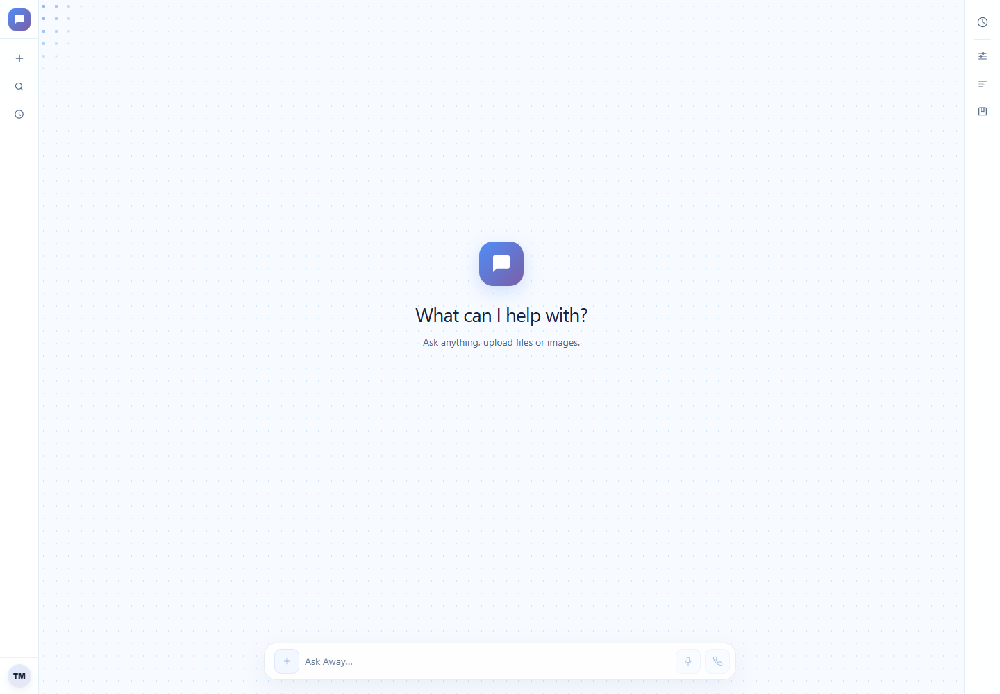
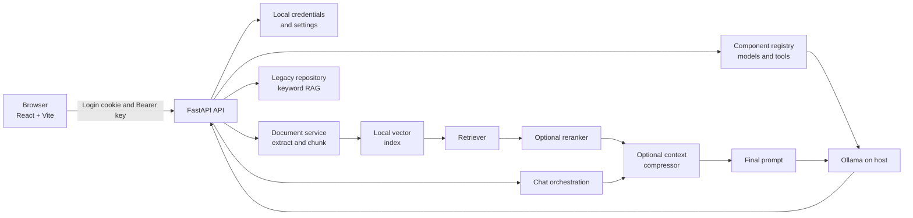

<div align="center">

# Local AI Coding Assistant

**A private local AI workspace for Ollama chat, document RAG, source
citations, and per-chat model/tool settings.**

[](https://www.python.org/)
[](https://fastapi.tiangolo.com/)
[](https://react.dev/)
[](https://ollama.com/)
[](https://docs.docker.com/compose/)
[](https://github.com/Jn527fd/local-ai-coding-assistant/actions/workflows/ci.yml)
[](LICENSE)

</div>

> [!IMPORTANT]
> **Public preview:** This is a functional local-first application, not a
> hosted SaaS or public multi-tenant service. It is designed for one operator
> on a trusted machine or private network.

## Overview

Local AI Coding Assistant is a full-stack app for developers who want useful
AI assistance without sending prompts, documents, or source code to a cloud
model provider.

The application connects a React dashboard to a FastAPI backend and a locally
installed Ollama service. You can sign in locally, choose AI components per
chat, upload documents, build local vector indexes, retrieve source snippets,
stream answers, inspect source metadata, and enable optional reranking or
context compression per conversation.

Internet access is required only when installing dependencies or downloading
new Ollama models. Chat prompts, generated repository indexes, credentials,
API keys, and source code remain on the host machine during normal use.

## Highlights

- Local Ollama chat with streaming responses and per-chat model selection.
- Document upload, PDF/text extraction, chunking, embeddings, search, and RAG.
- Source-grounded answers with source numbers, vector scores, rerank scores,
  warnings, and compression metadata.
- Local capability discovery for LLMs, embedders, rerankers, vision models,
  OCR engines, PDF parsers, chunkers, vector stores, RAG pipelines, and
  context compressors.
- Optional OCRmyPDF fallback for low-text PDFs and optional vision chat for
  local multimodal Ollama models.
- Docker Compose deployment, hermetic default tests, optional live Ollama smoke
  tests, and release-readiness documentation.

## Quick Links

| Need | Start here |
| --- | --- |
| Install and run locally | [Quick Start](#quick-start) |
| Understand the design | [Architecture](#architecture) and [docs/architecture.md](docs/architecture.md) |
| Review API behavior | [API Reference](#api-reference) and [docs/api.md](docs/api.md) |
| Run tests | [Testing](#testing) and [docs/testing.md](docs/testing.md) |
| Deploy safely | [Security and Privacy](#security-and-privacy) and [docs/deployment-hardening.md](docs/deployment-hardening.md) |
| See what comes next | [Roadmap](#roadmap), [roadmap_v2.md](roadmap_v2.md), and [feature_ideas_v2.md](feature_ideas_v2.md) |

## Application Preview

### Local Login



### Developer Dashboard



## Why This Project

This project demonstrates more than a basic LLM chat interface:

- **Full-stack engineering:** React/Vite frontend, FastAPI backend, typed
  request schemas, documented APIs, and containerized deployment.
- **Local AI integration:** Ollama model discovery, capability categorization,
  text generation, embeddings, and optional reranker adapters with no cloud LLM
  dependency.
- **Retrieval-augmented generation:** Document upload, extraction, chunking,
  local JSON vector indexing, retrieval-only search, RAG chat, source
  attribution, optional reranking, and context compression.
- **Security-conscious configuration:** Salted password hashes, HttpOnly
  sessions, Bearer authentication, ignored secret files, and safe templates.
- **Operational readiness:** Health checks, Docker Compose, non-root backend
  execution, restart policies, setup scripts, SQLite metadata migrations, and
  automated tests.

## Features

### Private Local AI

- Runs inference through Ollama on the host machine.
- Discovers locally installed Ollama models and categorizes LLMs, embedders,
  rerankers, vision models, and unknown models.
- Detects local OCR engines and PDF parsers when their Python packages or
  binaries are installed in the backend runtime.
- Keeps model selection per conversation instead of relying on one global UI
  switcher.
- Displays connection state, local model/tool inventory, and user-facing
  errors.
- Supports image attachments for chat requests when the active chat has a
  valid local Ollama vision model selected.
- Bounds chat context and model output to keep local inference responsive.

### Authentication and Account Management

- Login page backed by an editable local credentials file.
- Passwords stored as salted PBKDF2 hashes, never as plaintext.
- HttpOnly login sessions for account and model-management operations.
- Bearer API-key protection for chat and repository endpoints.
- Locally persisted API-key configuration with connection verification.
- No usernames, passwords, or API keys hardcoded in the source tree.

### Conversations

- Up to five browser-local chats per username by default.
- Optional backend conversation persistence stores chats in local JSON files
  under `data/conversations/` after the user opts in from Settings.
- A local SQLite metadata catalogue under `data/metadata/` records migrated
  users, settings, conversations, document metadata, and index metadata while
  preserving the JSON artifact stores.
- Isolated history and context for each conversation.
- Per-chat settings for LLM, embedder, OCR engine, PDF parser, chunker, vector
  database, RAG pipeline, reranker, context compressor, and vision model.
- Compact setting status lines show whether a selected capability is
  implemented, fallback-backed, detected but not wired, planned, or
  unavailable when that metadata is available.
- A visible verification button confirms the active chat's selected settings.
- New chats default to the first available LLM alphabetically.
- Complete chat deletion so removed messages are excluded from future prompts.
- A maximum of 30 recent messages per request, further bounded by a backend
  context-size limit.

### Documents and RAG

- Upload and process local documents through the backend.
- Show local job progress while processing and indexing documents.
- Support text, Markdown, PDF, DOCX, HTML, CSV, and TSV uploads with safe
  file-type sniffing before processing.
- Extract PDF text with PyMuPDF or pdfplumber when installed.
- Runs OCRmyPDF as a safe low-text PDF fallback when that binary is available
  and selected for the chat.
- Record extraction diagnostics and detect duplicate document uploads.
- Chunk documents with fixed and recursive chunking modes.
- Embed chunks with local Ollama embedding models.
- Store document chunks and vectors in a local JSON-backed index.
- Search indexed chunks without sending data to external services.
- Use retrieved chunks in chat prompts with stable source numbering and source
  metadata.
- Optionally rerank candidate chunks before prompt injection.
- Optionally compress long chat history and retrieved context before
  generation.

### Repository Intelligence

- Legacy repository indexing remains available through the backend API.
- Recursive indexing of local code repositories.
- Support for Python, JavaScript, TypeScript, React, Markdown, JSON, YAML,
  HTML, and CSS.
- Automatic exclusion of generated or dependency-heavy directories such as
  `.git`, `node_modules`, `.venv`, `dist`, and `build`.
- Human-readable JSON indexes with file paths and source line ranges.
- Keyword-overlap retrieval for transparent, dependency-light RAG.
- Grounded answers that return the source file paths used as context.

### Deployment and Developer Experience

- Dockerfiles for the FastAPI backend and production Nginx frontend.
- Docker Compose health checks and detached deployment.
- Linux setup and startup scripts.
- OpenAPI documentation at `/docs`.
- Dependency-injected pytest coverage that does not require Ollama or Docker.
- LAN access for trusted devices on the same home network.

## Architecture


```mermaid
flowchart LR
    Browser["Browser<br/>React + Vite"] -->|"Login cookie and Bearer key"| API["FastAPI API"]
    API --> Auth["Local credentials<br/>and settings"]
    API --> Components["Component registry<br/>models and tools"]
    API --> Chat["Chat orchestration"]
    API --> Documents["Document service<br/>extract and chunk"]
    Documents --> VectorIndex["Local vector<br/>index"]
    VectorIndex --> Retriever["Retriever"]
    Retriever --> Reranker["Optional reranker"]
    Reranker --> Compressor["Optional context<br/>compressor"]
    Chat --> Compressor
    Compressor --> Prompt["Final prompt"]
    Components --> Ollama["Ollama on host"]
    Prompt --> Ollama
    API --> RepoIndexer["Legacy repository<br/>keyword RAG"]
    Ollama --> API
```

### Request Flow

1. The user signs in with credentials stored in an ignored local JSON file.
2. The browser receives an HttpOnly session cookie for account controls.
3. Protected AI requests include the configured Bearer API key.
4. Each conversation sends its own selected AI component settings.
5. Document RAG retrieves local indexed chunks when enabled for the chat.
6. Optional reranking reorders candidate chunks before prompt construction.
7. Optional context compression trims or summarizes long prompts safely.
8. The API returns the generated answer, warnings, and contributing source
   metadata.

Detailed design notes are available in
[docs/architecture.md](docs/architecture.md).

## Technology Stack

| Area | Technology | Responsibility |
| --- | --- | --- |
| Frontend | React 18, Vite 8, CSS | Authentication, chat, account settings, documents, and source UI |
| Backend | Python, FastAPI, Pydantic | APIs, validation, sessions, orchestration, and component discovery |
| Local inference | Ollama | Model downloads, text generation, embeddings, and reranker prompts |
| Metadata | SQLite + local JSON artifacts | Migration bookkeeping and local metadata catalogue |
| Retrieval | JSON vector store, optional Chroma | Document vectors, source metadata, and legacy keyword RAG |
| HTTP client | HTTPX | Async communication with Ollama |
| Deployment | Docker, Docker Compose, Nginx | Reproducible frontend and backend services |
| Testing | pytest, FastAPI TestClient, Vitest, MSW | API, authentication, AI flow, documents, frontend, and Docker tests |

## Local Capability Discovery

The per-chat settings UI is backed by `GET /components/capabilities`. The
backend reuses Ollama model discovery, categorizes installed models, and also
checks for optional local tools. The response includes:

- `llmModels`
- `embedderModels`
- `rerankerModels`
- `visionModels`
- `ocrEngines`
- `pdfParsers`
- `chunkers`
- `vectorDatabases`
- `ragPipelines`
- `contextCompressors`
- `unknownOllamaModels`

Every installed model Ollama reports can appear automatically. The application
does not download or delete model files. You decide which models are
appropriate for your hardware by pulling them directly with Ollama.

Pull any suitable models directly with Ollama:

```bash
ollama pull qwen3:4b
ollama pull qwen2.5-coder:3b
ollama pull llama3.2:3b
ollama list
```

While Account is open, the Ollama status refreshes periodically; the
**Refresh local models/tools** button refreshes the capability inventory
immediately. Model and tool selection requires no internet connection after
installation. To reclaim disk space manually, use `ollama rm MODEL_NAME`.

Optional Python packages for detection and PDF extraction are installed through
`backend/requirements.txt`:

```text
pymupdf
pdfplumber
ocrmypdf
```

The default vector backend is local JSON storage. The optional Chroma adapter
is available when `chromadb` is installed in the backend runtime and
`VECTOR_STORE_BACKEND=chroma` is configured.

Tesseract is a system binary, so Docker images or host environments must
install `tesseract-ocr` separately if you want the `tesseract` engine detected.

## Quick Start

### Prerequisites

The primary setup path targets Linux Mint or another modern Linux host with:

- Python 3.10 or newer
- Node.js 20.19+ or 22.12+
- npm
- Ollama
- Docker Engine and Docker Compose for container deployment
- An NVIDIA GPU and working driver are recommended, but not required

Windows users can run the app through WSL or Docker, but the setup scripts and
examples in this README are written for a Linux shell. See
[docs/setup.md](docs/setup.md) for the fuller environment notes.

Verify optional NVIDIA acceleration:

```bash
nvidia-smi
```

Install Ollama using the
[official Linux instructions](https://docs.ollama.com/linux), then pull the
default model:

```bash
ollama pull qwen3:4b
curl http://127.0.0.1:11434/api/tags
```

### Local Development

From the repository root:

```bash
bash scripts/setup.sh
.venv/bin/python scripts/manage_credentials.py set YOUR_USERNAME
bash scripts/start.sh
```

Open:

- Frontend: `http://localhost:5173`
- Backend: `http://localhost:8000`
- OpenAPI docs: `http://localhost:8000/docs`

After signing in, open the account menu and create an API key. Short keys are
accepted for local testing, but a longer private key is recommended for normal
use. The application stores it only in ignored local configuration and the
current browser profile.

Press `Ctrl+C` in the startup terminal to stop both development servers.

### Docker Compose

Ollama remains installed on the Linux host. Compose runs the frontend and
backend:

```bash
cp .env.example .env
cp backend/.env.example backend/.env
mkdir -p data/config
cp credentials.example.json data/config/credentials.json
cp app-settings.example.json data/config/app-settings.json
python3 scripts/manage_credentials.py set YOUR_USERNAME
sed -i "s/^APP_UID=.*/APP_UID=$(id -u)/" .env

docker compose up --build --detach
docker compose ps
```

Both services should eventually report as healthy. Useful lifecycle commands:

```bash
docker compose logs --follow
docker compose restart
docker compose down
```

Detached containers continue running after the terminal or SSH session closes.
The `restart: unless-stopped` policy restarts them after a reboot once Docker
is available.

## Access from Another Computer

The application can be used from another trusted device on the same network.
Find the Linux host address:

```bash
hostname -I
```

By default, `FRONTEND_API_BASE_URL=auto` makes the browser call the backend on
the same hostname or IP address you used to open the frontend. For a host
address such as `192.168.1.50`, open:

```text
http://192.168.1.50:5173
```

If you previously hardcoded `FRONTEND_API_BASE_URL` in `.env`, either remove
that override or set it back to:

```dotenv
FRONTEND_API_BASE_URL=auto
```

Then rebuild the frontend once:

```bash
docker compose up --build --detach
```

> [!WARNING]
> This is a trusted-network application. Do not expose ports `5173`, `8000`,
> or `11434` directly to the public internet.

## Using the Application

### Chat with a Model

1. Sign in with a configured local user.
2. Open the account menu and save an API key.
3. Verify the API status shows as connected.
4. Choose the active chat's model and AI settings in Conversation Settings.
5. Press **Verify chat settings** if you want an explicit confirmation.
6. Submit a prompt.

Changing a chat's model or RAG settings does not clear the conversation. Other
chats keep their own settings.

### Upload and Search Documents

Document workflows use the active chat's settings. A typical local RAG setup is:

1. Pull a small chat model and an embedding model with Ollama.
2. Select the LLM and embedder in Conversation Settings.
3. Upload a document in the workspace.
4. Build an index for that conversation.
5. Ask a question with document RAG enabled.

RAG responses include source metadata. When reranking is enabled and succeeds,
sources can include both vector and rerank scores. When context compression is
enabled, responses include compression metadata and warnings when trimming or
fallbacks occur.

OCRmyPDF fallback is implemented for scanned or low-text PDFs. Other detected
OCR engines are surfaced for capability visibility but are not wired into the
document pipeline yet. Vision chat works when a local multimodal Ollama model
is selected for the active chat.

### Index a Repository

For local development, enter an absolute path readable by the backend:

```text
/home/user/projects/example-repository
```

For Docker, repositories are mounted read-only beneath `/repositories`:

```text
/repositories/sample-code-repository
```

### Ask a Grounded Question

After indexing, provide the generated repository name and ask a focused
question. The response includes the source paths selected by the retriever.

## API Reference

The backend exposes documented FastAPI routes for:

- authentication and local account state
- model status and component capability discovery
- complete and streaming chat responses
- optional backend conversation persistence, migration, import, and export
- document upload, processing, indexing, search, and index deletion
- local repository indexing and grounded repository questions
- health checks and application metadata

OpenAPI documentation is available at `/docs` when the backend is running.
See [docs/api.md](docs/api.md) for endpoint details, request schemas,
response examples, and error behavior.

## Document and Repository Indexing

Document upload currently supports plain text, Markdown, PDF, DOCX, HTML,
CSV, and TSV files. Uploads are sniffed before processing so obvious
extension/content mismatches fail with clear errors. PDF extraction uses
PyMuPDF or pdfplumber when installed in the backend runtime. Processed chunks,
extraction diagnostics, and embeddings are stored under ignored local data
directories. Duplicate uploads in the same conversation reuse existing
document metadata instead of storing another copy.

Supported file extensions:

```text
.py .js .jsx .ts .tsx .md .json .yaml .yml .html .css
```

Ignored directories:

```text
.git node_modules .venv __pycache__ dist build
```

Legacy repository indexes are stored as readable JSON under `data/indexes/`.
Document vectors use local JSON-backed storage by default, with an optional
Chroma adapter available when `chromadb` is installed and
`VECTOR_STORE_BACKEND=chroma` is set. Vector backend health and fallback
diagnostics are available from `/vectorstores/health`, and collection
export/import/migration endpoints can copy portable vector payloads between
available adapters. Qdrant and LanceDB are reported as deferred adapters for
now. Re-indexing a directory with the same final directory name replaces its
previous repository index.

GitHub cloning is not implemented yet. Clone a GitHub repository locally, then
index its local path.

## Configuration

Safe templates are committed for every local configuration file:

| Template | Local file | Purpose |
| --- | --- | --- |
| `.env.example` | `.env` | Docker build, LAN address, and repository mounts |
| `backend/.env.example` | `backend/.env` | Backend, Ollama, and security settings |
| `frontend/.env.example` | `frontend/.env` | Development API URL |
| `credentials.example.json` | `data/config/credentials.json` | Local users and password hashes |
| `app-settings.example.json` | `data/config/app-settings.json` | Active API key and legacy model fallback |

Important inference settings:

| Variable | Default | Purpose |
| --- | ---: | --- |
| `OLLAMA_TIMEOUT_SECONDS` | `120` | Generation request timeout |
| `OLLAMA_NUM_PREDICT` | `768` | Maximum generated tokens |
| `OLLAMA_THINK` | `false` | Enable supported models' extended thinking |
| `OLLAMA_KEEP_ALIVE` | `10m` | Keep the active model loaded between requests |
| `CHAT_CONTEXT_MAX_CHARS` | `12000` | Bound conversation context size |
| `RAG_TOP_K` | `5` | Maximum retrieved chunks added to a RAG prompt |
| `RAG_CANDIDATE_K` | `20` | Default candidate chunks fetched before reranking |
| `RAG_MAX_TOP_K` | `20` | Hard cap for requested RAG result count |
| `RERANKER_MAX_CANDIDATES` | `50` | Hard cap for reranker candidate scoring |
| `CONTEXT_COMPRESSION_MAX_PROMPT_CHARS` | `12000` | Prompt budget for optional compression |
| `CONTEXT_COMPRESSION_RECENT_MESSAGES_TO_KEEP` | `10` | Recent messages kept verbatim during compression |
| `CONTEXT_COMPRESSION_MAX_RETRIEVED_CONTEXT_CHARS` | `6000` | Retrieved context budget during compression |
| `CONTEXT_COMPRESSION_MAX_SUMMARY_CHARS` | `2000` | Maximum summarizer memory block length |
| `DOCUMENT_MAX_UPLOAD_BYTES` | `26214400` | Maximum uploaded document size |
| `DOCUMENT_CHUNK_SIZE` | `2000` | Target document chunk size |
| `DOCUMENT_MAX_CHUNKS` | `500` | Maximum chunks kept from one processed document |
| `EMBEDDING_BATCH_SIZE` | `16` | Maximum chunks embedded per local batch |
| `VECTOR_STORE_BACKEND` | `json` | Active vector backend; `chroma` is optional when `chromadb` is installed |
| `CONVERSATION_MAX_COUNT` | `50` | Maximum backend-persisted conversations per local user |
| `METADATA_DATABASE_FILE` | empty | Optional override for the local SQLite metadata database |

Real `.env`, credentials, application settings, generated indexes, virtual
environments, dependencies, and build output are excluded by `.gitignore`.
The backend test suite includes a repository hygiene check that fails if an
ignored local artifact becomes tracked.

## Testing

The default test path is hermetic. Backend tests use temporary local
configuration and mocked Ollama clients; frontend unit tests use MSW handlers;
browser tests can boot `tests/fakes/fake_ollama.py`. No default test requires
Ollama, a GPU, downloaded models, host data, or network access.

```bash
python -m pip install -r requirements-dev.txt
npm --prefix frontend install

make test-backend
make test-frontend
make test
```

Dockerized checks build clean test images from the committed dependency files:

```bash
make test-backend-docker
make test-frontend-docker
make test-docker
```

GitHub Actions runs backend pytest and frontend lint/test/build on pushes to
`main`, `phase-*` branches, and pull requests. Docker verification is available
as a manual workflow so the default CI path stays fast and Ollama-free.

Quick smoke checks are also available:

```bash
make smoke
make smoke-docker
```

Live Ollama tests are opt-in and skipped by default. They never run unless
`RUN_OLLAMA_TESTS=1` is set:

```bash
RUN_OLLAMA_TESTS=1 make test-ollama
OLLAMA_TEST_MODEL=qwen3:4b RUN_OLLAMA_TESTS=1 make test-ollama
```

CPU-friendly live app-flow smoke tests are also opt-in. They use tiny models
only to validate wiring on a CPU laptop:

```bash
make setup-ollama-smoke
RUN_OLLAMA_TESTS=1 make test-ollama-smoke
```

The default smoke models are `smollm2:135m` for chat and `all-minilm` for
embeddings. Set `PULL_RERANKER=1` only if you also want to pull the optional
reranker smoke model.

Playwright tests remain separate from the default frontend CI script:

```bash
cd frontend
npm run test:e2e
```

See [docs/testing.md](docs/testing.md) for the full testing workflow.
Retrieval quality regression coverage uses a small fake-provider corpus in
`tests/fixtures/retrieval_eval/`; it is deterministic and does not require
Ollama.

Before a public release or remote deployment, also review the
[release checklist](docs/release-checklist.md),
[deployment hardening guide](docs/deployment-hardening.md),
[backup and restore guide](docs/backup-restore.md), and
[dependency and security review](docs/dependency-security.md).

## Security and Privacy

- Passwords are salted and hashed with PBKDF2.
- Login sessions are stored in backend memory and delivered through HttpOnly
  cookies.
- Protected AI routes use constant-time Bearer-key comparison.
- Secrets and mutable configuration are stored only in ignored local files.
- Repository mounts are read-only in the default Docker configuration.
- Logs include operational metadata, not prompts, passwords, or API keys.
- Model switching rejects names that are not installed in local Ollama.

This project is designed for a trusted local network, not as a hardened
internet-facing multi-tenant service. Review the
[current limitations](#current-limitations) before broader deployment.

## Project Structure

```text
local-ai-coding-assistant/
|-- backend/
|   |-- app/
|   |   |-- ai/            # Providers, embedders, rerankers, compressors, and vector stores
|   |   |-- auth/          # Credentials, sessions, and Bearer validation
|   |   |-- rag/           # Legacy repository chunking, indexing, and retrieval
|   |   |-- routers/       # FastAPI route modules
|   |   |-- schemas/       # Pydantic request and response models
|   |   `-- services/      # Documents, Ollama, settings, models, and repositories
|   |-- Dockerfile
|   `-- requirements*.txt
|-- frontend/
|   |-- src/components/    # Login, chat, account, status, and repo UI
|   |-- Dockerfile
|   `-- nginx.conf
|-- tests/                 # Isolated backend tests
|-- scripts/               # Linux setup, startup, and credential tools
|-- docs/                  # Architecture, API, and setup guides
|-- data/                  # Ignored local settings, metadata, and generated indexes
|-- sample-code-repository/
|-- docker-compose.yml
`-- Makefile
```

## Current Limitations

- Document vectors use local JSON storage by default. Chroma is available as
  an optional adapter when `chromadb` is installed; Qdrant and LanceDB are
  explicitly deferred and reported through backend health metadata.
- Legacy repository RAG still uses keyword overlap.
- OCRmyPDF fallback exists for low-text PDFs, but broad OCR expansion and UI
  workflows are still early.
- Vision chat requires a local multimodal Ollama model and is not part of the
  default tiny smoke-model setup.
- Semantic and memory context compression modes currently fall back safely to
  implemented compressors.
- Chat streaming is implemented for generation; broader runtime progress for
  every long-running operation is still limited.
- Login sessions are in memory and end when the backend restarts.
- Browser chat persistence uses local storage by default. Backend JSON
  persistence is opt-in, local to this installation, and mirrored into the
  SQLite metadata catalogue.
- GitHub repositories must be cloned locally before indexing.
- The default deployment assumes a trusted home or development network.

## Roadmap

The next release track is captured in [Roadmap v2](roadmap_v2.md). The highest
priority items are:

- Stabilize the public release candidate with repeatable local, Docker, and
  manual smoke verification.
- Move conversation history and settings from browser-only storage to an
  exportable server-side store.
- Add background jobs for long-running indexing, OCR, retrieval, and model
  operations.
- Continue expanding OCR coverage, vector-store adapters, and retrieval
  quality evaluation.
- Harden the trusted-network deployment model with stronger observability,
  packaging, backup, and security controls.

## Documentation

- [Architecture](docs/architecture.md)
- [API reference](docs/api.md)
- [Linux Mint setup](docs/setup.md)
- [Testing](docs/testing.md)
- [Development roadmap](docs/development-roadmap.md)
- [Deployment hardening](docs/deployment-hardening.md)
- [Backup and restore](docs/backup-restore.md)
- [Dependency and security review](docs/dependency-security.md)
- [Release checklist](docs/release-checklist.md)
- [Security policy](SECURITY.md)
- [Changelog](CHANGELOG.md)
- [Roadmap v2](roadmap_v2.md)
- [Feature ideas v2](feature_ideas_v2.md)

## Contributing

This project is under continuous development. Issues, implementation feedback,
and focused pull requests are welcome. Please avoid committing secrets,
generated indexes, local model files, or machine-specific configuration.

## License

Distributed under the MIT License. See [LICENSE](LICENSE).
